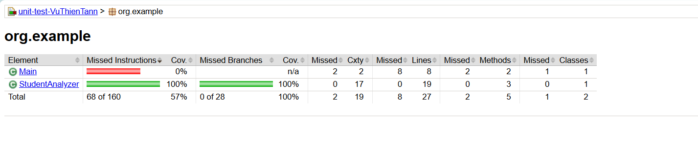

# 🧪 Bài Tập Thực Hành Kiểm Thử với JUnit

## 🎯 Chủ đề
**Phân tích dữ liệu điểm số học sinh**

## 🎓 Mục tiêu học tập
- Viết hàm xử lý điều kiện và vòng lặp trong Java
- Viết test case bằng JUnit để kiểm thử toàn diện
- Sử dụng GitHub để quản lý mã nguồn
- Tích hợp kiểm thử vào quy trình phát triển phần mềm

---

## 📌 Yêu cầu chức năng

### ✅ Lớp `StudentAnalyzer` gồm 2 phương thức:

#### `public int countExcellentStudents(List<Double> scores)`
- Đếm số học sinh có điểm từ **8.0 đến 10.0**
- Bỏ qua các điểm < 0 hoặc > 10 (xem là dữ liệu không hợp lệ)
- Trả về `0` nếu danh sách rỗng hoặc không có điểm hợp lệ

#### `public double calculateValidAverage(List<Double> scores)`
- Tính **trung bình cộng** của các điểm hợp lệ (từ `0` đến `10`)
- Bỏ qua điểm âm hoặc trên `10`
- Trả về `0.0` nếu danh sách rỗng hoặc không có điểm hợp lệ

---

## 🧪 Kiểm thử bằng JUnit

### Các test case được xây dựng bao gồm:

#### ✅ Trường hợp bình thường:
- Danh sách điểm có hợp lệ + không hợp lệ lẫn lộn
- Danh sách toàn điểm hợp lệ

#### ✅ Trường hợp biên:
- Danh sách rỗng
- Danh sách chỉ có điểm 0 hoặc 10

#### ✅ Trường hợp ngoại lệ:
- Có điểm âm hoặc lớn hơn 10

## Độ phủ mã

## ▶️ Hướng dẫn chạy kiểm thử

### ✅ Cách 1: Chạy bằng IntelliJ IDEA
- Mở project
- Click chuột phải vào file `StudentAnalyzerTest.java` → **Run 'StudentAnalyzerTest'**

### ✅ Cách 2: Dùng Maven (nếu có `pom.xml`)

Link repo: https://github.com/ta-n-n/unit-test-VuThienTan